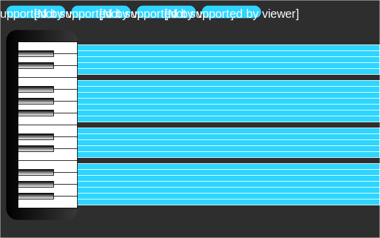

## Pro Piano

### Background

Pro Piano is piano roll simulator app that allows you to write songs for the piano online. The original piano roll was a continuous roll of paper with holes punched into it used to operate a player piano. The player piano, like this app, reads the roll and plays the corresponding notes.

### Functionality & MVP  

With this piano roll simulator, users will be able to:

- [ ] A playable piano
- [ ] Start, stop, and reset the piano roll
- [ ] Select squares to be played by the piano
- [ ] Choose from preset demo songs

In addition, this project will include:

- [ ] An About modal describing the background and rules of the app
- [ ] A production Readme

### Wireframes

This app will consist of a two-octave keyboard on the left side which can be played by clicking on the keys. To the right will be the piano roll consisting of blocks of 16th notes which can be selected by the user. Click and drag will be implemented as continuous notes, while individual selection will by new keyboard hits. The top will have play, stop, and reset buttons along with preset songs.

### Architecture and Technologies

This project will be implemented with the following technologies:

- React/Redux for overall structure and app logic
- Vanilla HTML audio tag
- SASS for styling
- Webpack to bundle and serve up the various scripts.

Notes created by the user will contain data about the position, duration, and tone for each note. These will be stored in an array as the user creates them. When the play button is clicked, the notes are retrieved based on their position and the associated audio will be played.

### Implementation Timeline

**Day 1**: Setup all necessary Node modules, including getting webpack up and running.  Create `webpack.config.js` as well as `package.json`.  Write a basic entry file and the bare bones of the piano.  

**Day 2**: Get the piano working for clicking and playing the sounds. Start biulding the logic for the piano roll.

**Day 3**: Continue working on piano roll logic

**Day 4**: Add demo songs, production readme, and work on additional styling and bug fixes

### Bonus features

Some anticipated updates are:

- [ ] Looping
- [ ] Additional octaves
- [ ] Adding additional sounds
- [ ] Saving sounds to be recorded/saved
